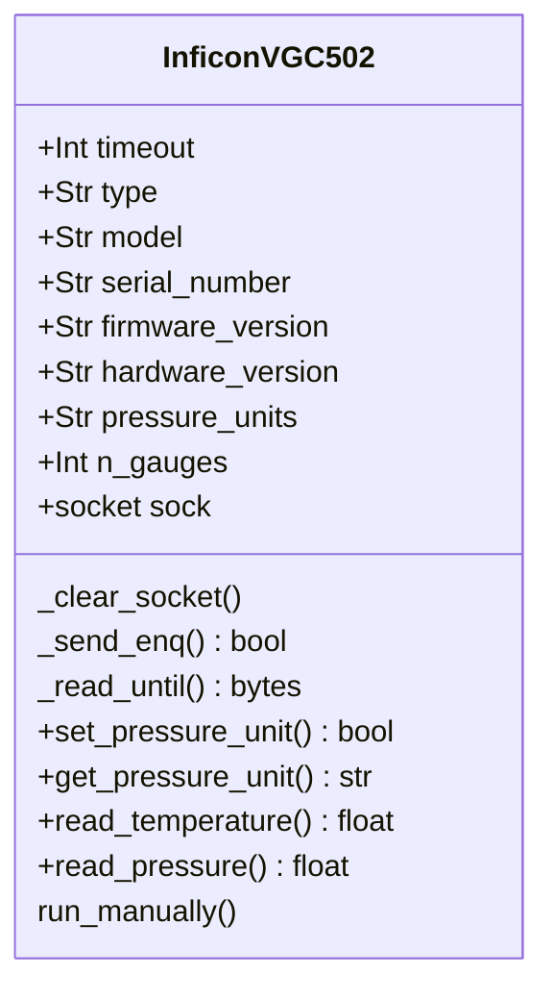

# InficonVGC502 

A Python 3 module to communicate with an INFICONVGC502 controller over TCP.
It supports reading pressure values from one or more gauges.

## Currently Supported Models
- VGC501, VGC502

## Features
- Connect to VGC controller
- Read out the pressure

## 🛠️ Requirements

- Python 3.7+
- Install base class from https://github.com/COO-Utilities/hardware_device_base

## Installation

```bash
pip install .
```

## 🧪 Running from a Python Terminal

You can also use the `INFICON` module interactively from a Python terminal or script:

```python
from inficonvgc502 import InficonVGC502

vgc502 = InficonVGC502()
vgc502.initialize()
pressure = vgc502.get_atomic_value("pressure1") # must have gauge number
print(f"Pressure: {pressure} Torr")
```

## Testing
Unit tests are in the `tests/` directory.

To run all tests from the projecgt root:

```bash
python -m pytest
```

## Class Diagram

Below is a class diagram of the added methods and attributes for the Inficon.
See the README for the hardware_device_base module for the inherited methods and
attributes.

